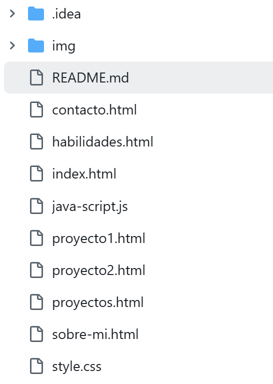

# TA05-MizhquiriTrishan-ASIXc1D -- Professional Portfolio

This repository contains the source code of my **professional portfolio** as a Systems and Network Administrator, specialized in **Cybersecurity**. The website showcases my projects, technical skills, and contact information.

## Main Sections

- **Home**: General introduction and featured projects.
- **Projects**: Full list of technical projects related to:
  - Automation (Bash, PowerShell, Python)
  - Network monitoring (NetFlow, Wireshark, Nmap)
  - System hardening (SSH, Apache, iptables, password policies)
  - Server management (Ubuntu Server, Windows Server)
  - Backups & integrity (GPG, SHA256 hashing, cron, Robocopy)
- **About Me**: Professional bio and work philosophy.
- **Skills**: Detailed overview of infrastructure, cybersecurity, and automation expertise.
- **Contact**: Ways to collaborate or hire my IT services.

## Technologies Used

- **Frontend**: HTML5, CSS3 (responsive design), JavaScript
- **Style**: Cyberpunk-inspired color palette with violet and neon tones
- **Visual effects**: Animated particle background (HTML5 Canvas)
- **Icons**: Font Awesome
- **Structure**: Clean, organized file hierarchy

## Project Structure

## Project Goals

This portfolio aims to:
- Visually and functionally demonstrate my technical abilities.
- Showcase my capacity to build a professional website without frameworks.
- Serve as an entry point for collaborations, internships, or IT service contracts.

## Contact

📧 **Email**: trishan.mizhquiri@email.com  
📍 **Location**: Barcelona, Spain (available for remote projects)  
🔗 **LinkedIn**: [Professional Profile](#) *(update link when public)*

© 2025 Trishan Mizhquiri Valencia – Systems & Network Administrator | Cybersecurity Specialist
